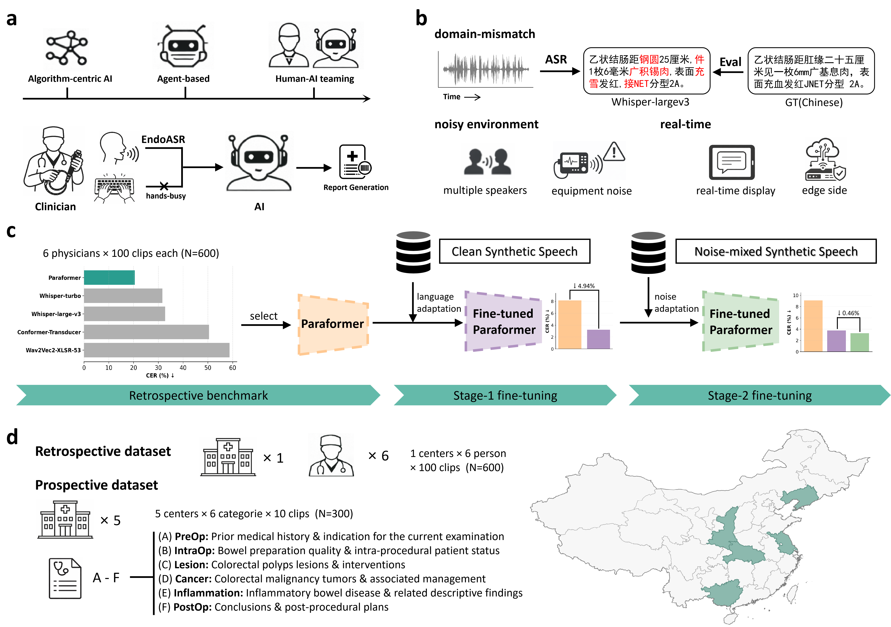

# EndoASR: Domain-adapted Speech Recognition for Human–AI Teaming in Gastrointestinal Endoscopy

## Overview

EndoASR is a domain-adapted automatic speech recognition (ASR) system designed as a real-time speech interface for human–AI teaming in gastrointestinal endoscopy.

This work addresses the **out-of-distribution (OOD) challenge** of deploying general-purpose ASR systems in clinical environments characterized by:
- Dense medical terminology  
- Complex acoustic noise  
- Real-time, hands-busy procedural workflows  

We propose a **two-stage adaptation strategy**:
1. **Stage 1 (Language adaptation):** fine-tuning on synthetic speech generated from real clinical endoscopy reports  
2. **Stage 2 (Noise adaptation):** further fine-tuning with noise-augmented speech  

EndoASR is validated on both retrospective clinical data and a prospective multi-center dataset across five hospitals.

---

## Method Overview

<!-- Replace with your figure -->
<p align="center">
  
</p>

---

## Demo

We provide two side-by-side demo videos comparing **EndoASR** and **Whisper-large-v3** in the same LLM-based clinician–AI interaction pipeline.

For each demo:
- **Left panel:** EndoASR  
- **Right panel:** Whisper-large-v3  

These videos highlight the impact of ASR quality on downstream structured information extraction and real-time human–AI collaboration.

<p align="center">
  <a href="demo/demo1.mp4">▶ Demo 1</a> |
  <a href="demo/demo2.mp4">▶ Demo 2</a>
</p>

## Installation

```bash
git clone https://github.com/ku262/EndoASR.git
cd EndoASR
pip install -r requirements.txt

# Install FunASR (required dependency)
git clone https://github.com/alibaba/FunASR.git
cd FunASR
pip install -e .
cd ..
```

---

## Data Preparation

Synthetic training data is constructed from **real clinical endoscopy reports**:

- Text: authentic reports  
- Audio: generated via TTS  
- Noise: mixed with real endoscopy-room recordings  

Example format:

```json
{
  "source": "path/to/audio.wav",
  "target": "内镜报告文本"
}
```

---

## Training

### Stage 1: Language Adaptation

```bash
.\src\finetune_stage1.ps1
```

### Stage 2: Noise Adaptation

```bash
.\src\finetune_stage2.ps1
```

---

## Inference

```bash
python src/infer.py
```

---

## Evaluation

Metrics:
- Character Error Rate (CER)
- BLEU-1
- BERTScore
- Medical Terminology Accuracy (Med ACC)

```bash
python eval/eval.py
python eval/eval_acc.py
```

---

## Key Features

- Domain adaptation for clinical OOD speech  
- Two-stage training for language and noise robustness  
- Real-time performance with edge deployment capability  
- Prospective multi-center validation  
- Integration with LLM-based structured extraction  

---

## Notes

- Built upon FunASR: https://github.com/alibaba/FunASR  
- The base ASR model is initialized from publicly available Paraformer checkpoints.
- Full datasets will be released upon publication (subject to approval)  

---

## Citation

```bibtex
@article{,
  title={Development and Multi-center Evaluation of Domain-adapted Speech Recognition for Human–AI Teaming in Real-world Gastrointestinal Endoscopy},
  author={},
  journal={},
  year={}
}
```

---

## Acknowledgements

This project is built upon the FunASR toolkit and the Paraformer architecture. We thank the authors for making their code and models publicly available.

If you use this code, please also consider citing:

```bibtex
@article{shi2023seaco,
  author={Xian Shi and Yexin Yang and Zerui Li and Yanni Chen and Zhifu Gao and Shiliang Zhang},
  title={SeACo-Paraformer: A Non-Autoregressive ASR System with Flexible and Effective Hotword Customization Ability},
  journal={arXiv preprint arXiv:2308.03266},
  year={2023}
}
```
